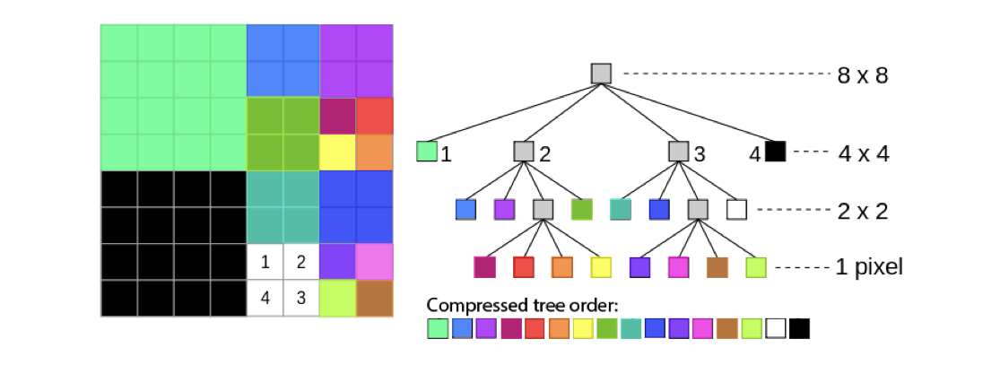
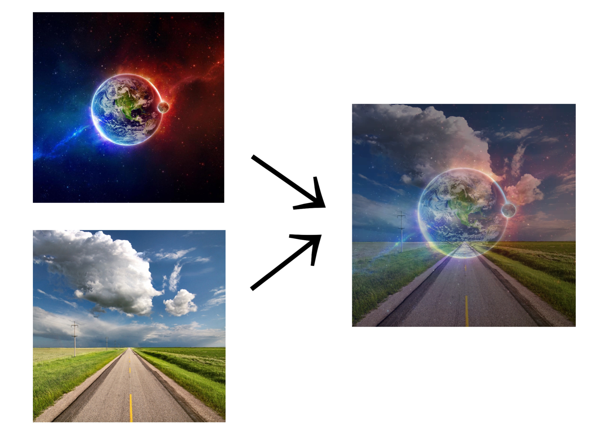

<h1 align = "center"> PPM Image Editor using QuadTree </h1>

 PPM Image editor and compressor implemented by using <b>QuadTree</b> Data Structure. 

## Tools
 ### 1. COMPRESS
   - Takes original PPM image, converts it to QuadTree then writes in binary file: number of colors, number of QuadTree nodes and **the compressed tree**.
   - Block division algorithm stops when the mean of the block is smaller or equal than the threshold given by input.
   - The bigger the threshold, the clearer our image is.
   
   

 ### 2. DECOMPRESS
   - Given image compression, it returns the PPM image by rebuilding the QuadTree.
   
 ### 3. MIRROR
   - Takes PPM image and converts it **horizontally** or **vertically**.
   
 ### 4. OVERLAY
   - Takes two PPM images and overlays them by using given threshold.
   
   
